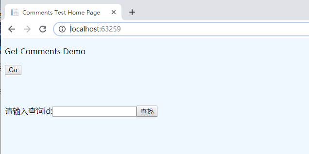
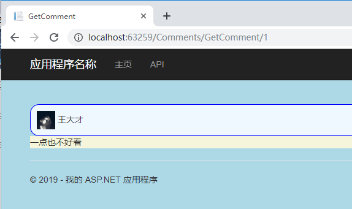
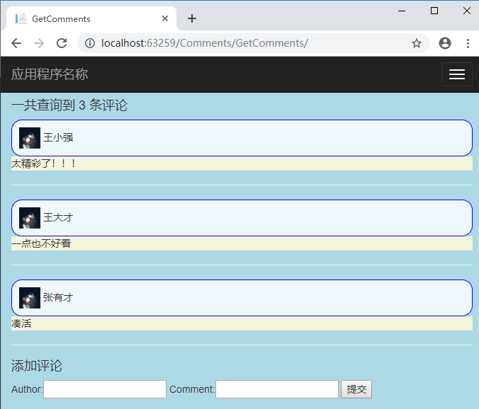
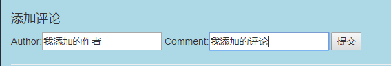
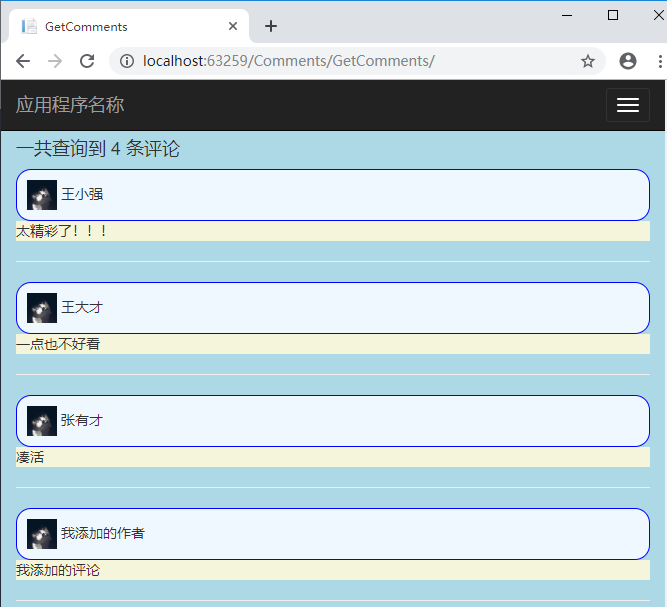

# 作业四

# 项目概况
   一个Web API项目，主要实现对Comment的查询和添加，无法进行删除，查询可以输入id号进行查询。在查看所有评论界面可以添加评论。
# 实现细节
  在Model中定义了Comment类，保存用户的评论记录，在CommentComtroller类中定义一个List,保存Comment记录。同时有Index作为展示入口。点击上面的Go按钮，查看所有的Comments,或者在查询框中输入Comment的id进行查询。
# 运行截图
##  首页
  
##  查询id
  
##  查看所有的评论
  
##  输入添加的评论
  
##  点击提交按钮
  
# 说明
   作业四中有许多Controller，但只有CommentsController是作业四的，别的都是进行测试使用过的，因为设置了路由，对运行不会有影响。

